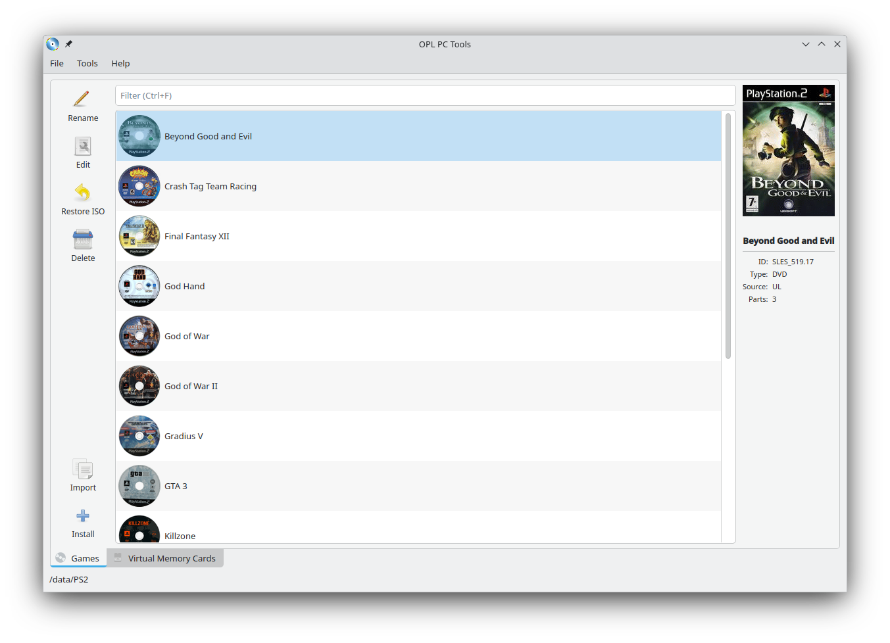
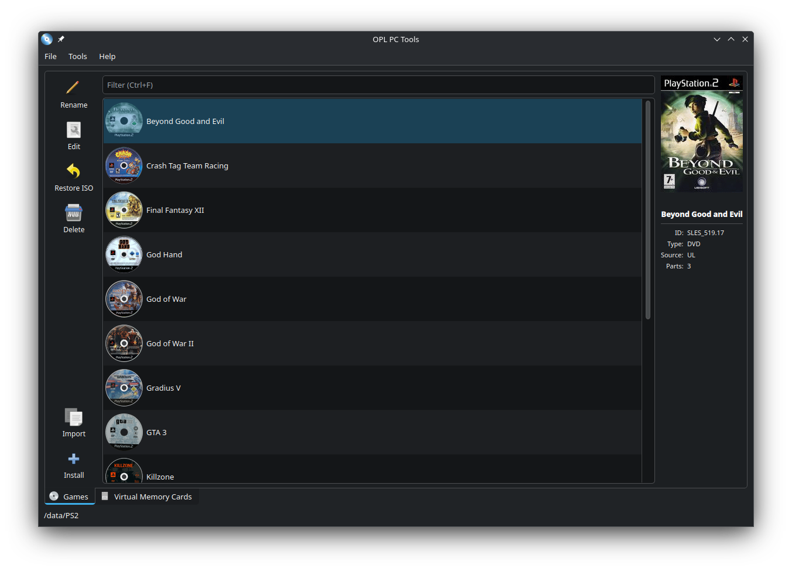
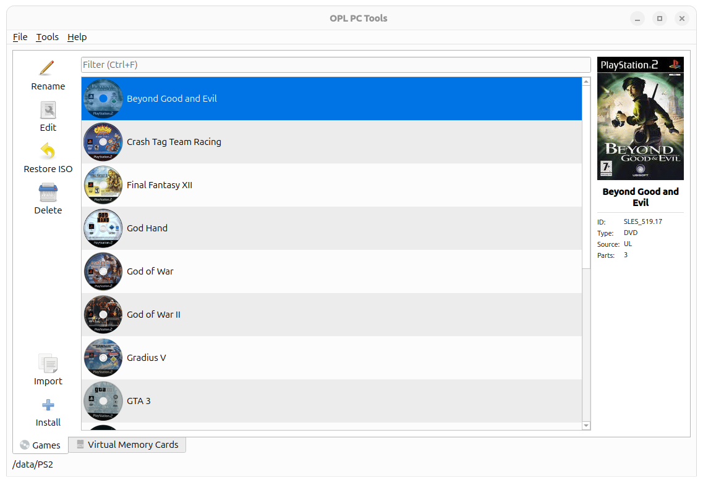
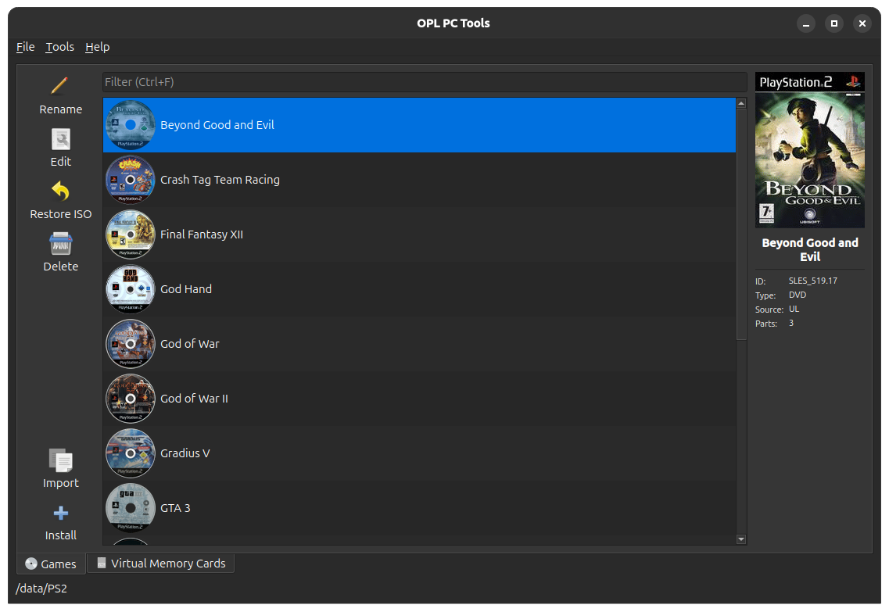
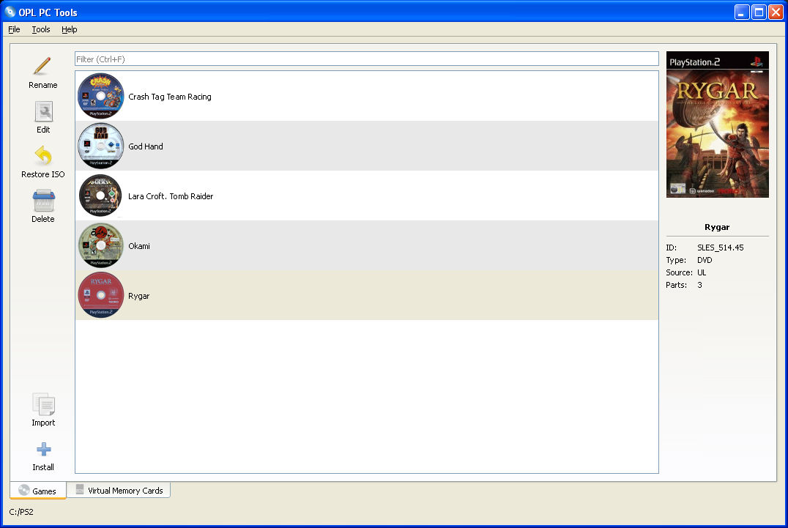
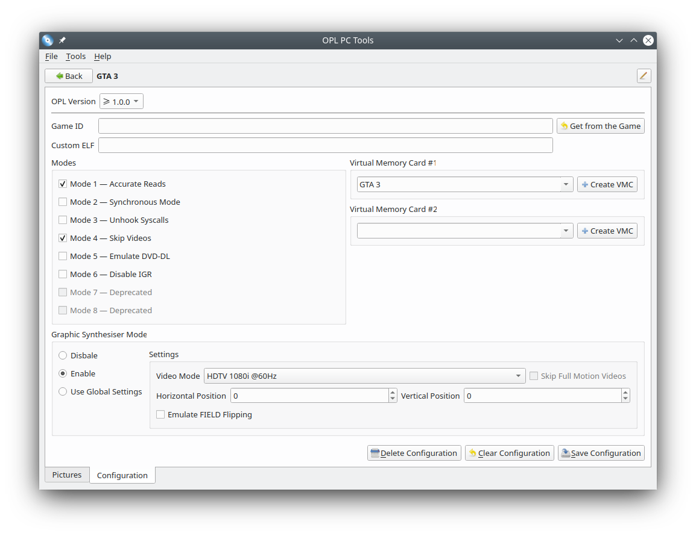
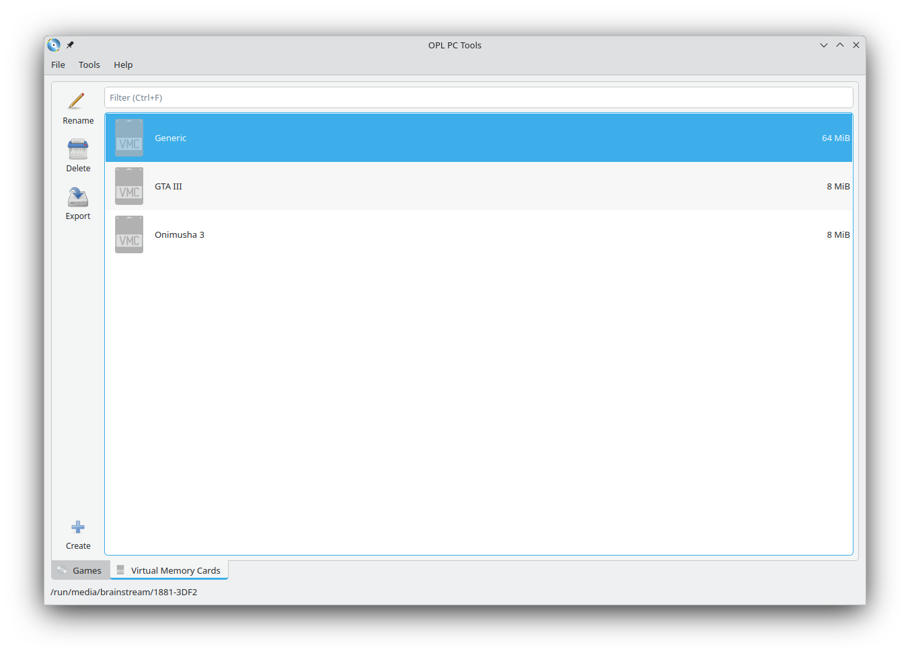
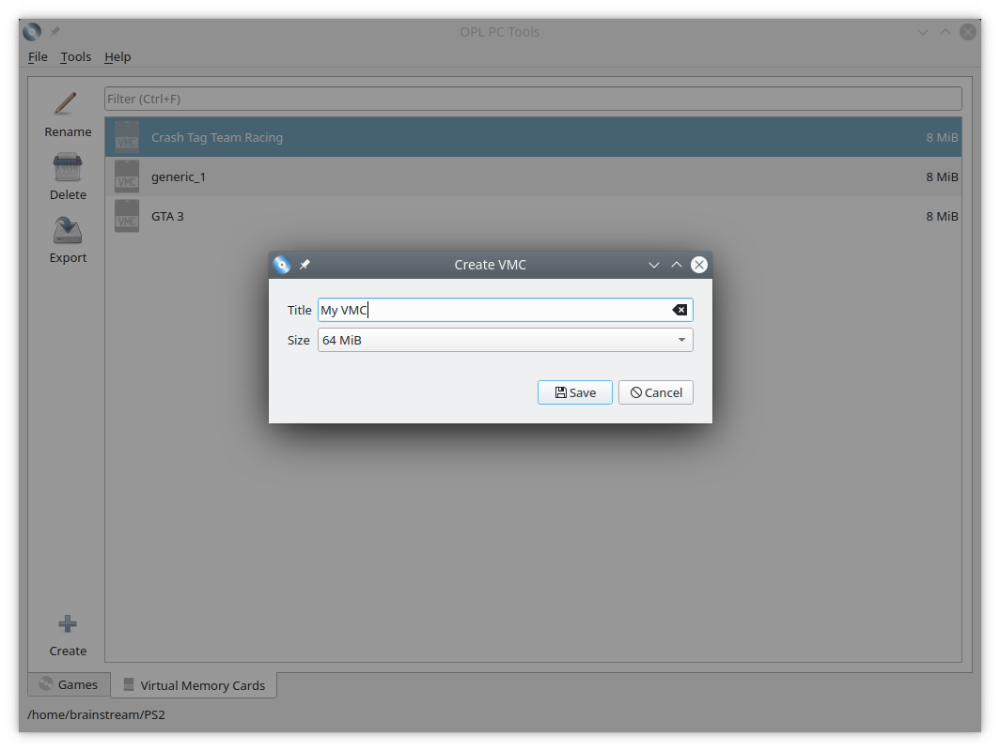
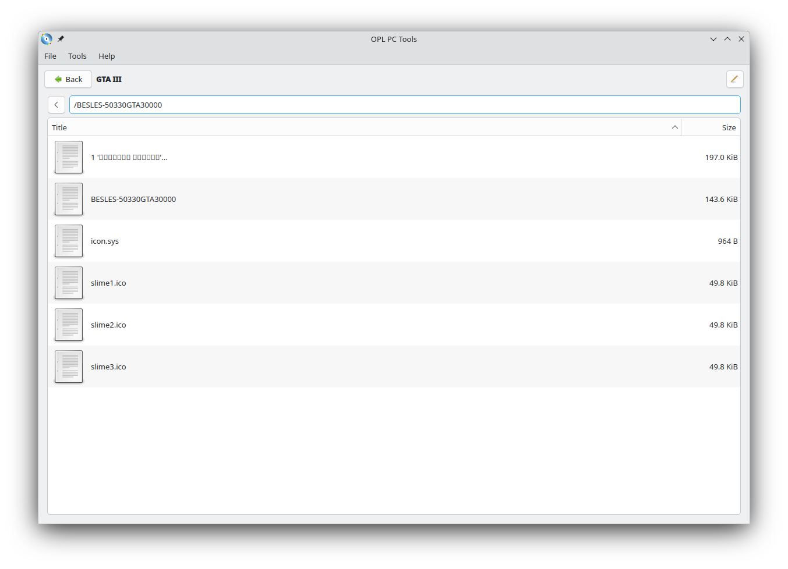

# OPL PC Tools

Desktop tools for working with [Open PS2 Loader](https://github.com/ifcaro/Open-PS2-Loader) storages. Written in Qt and can be run on Linux and MS Window (XP and higher).

With OPL PC Tools you can:

- Manage your game collection;
- Set pictures for games;
- Download game images from the Internet;
- Install multiple games from different sources (CD/DVD drive or \*.iso, \*.bin, \*.nrg files) in automatic sequential mode;
- Import games from other OPL storages;
- Recover \*.iso files from installed games;
- Edit game settings;
- Create virtual memory cards;
- Read virtual memory cards and export data from them.

## Screenshots

