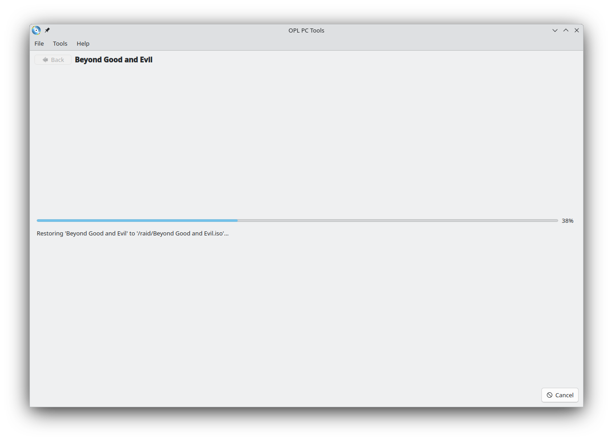

# OPL PC Tools
Tools for managing PS2 disc images used in [Open PlayStation 2 Loader](https://github.com/ifcaro/Open-PS2-Loader).

Written in Qt and running under Linux and MS Window. It is possible to build the application under MacOS X and FreeBSD,
but the CD/DVD sources will not work. It is a known issue and I am planning to fix it. Someday.

It is the absolutely open project and everyone are welcome to contribute to. But please, remember about the code-style!

## With OPL PC Tools You Can

### Manage Your Game Collection

### Manage Game Pictures

### Iinstall Multiple Games From the Different Sources (CD/DVD or *.iso, *.bin, *.nrg files) in the Automatic Sequential Mode

### Recover the *.iso Files From the Installed Games

