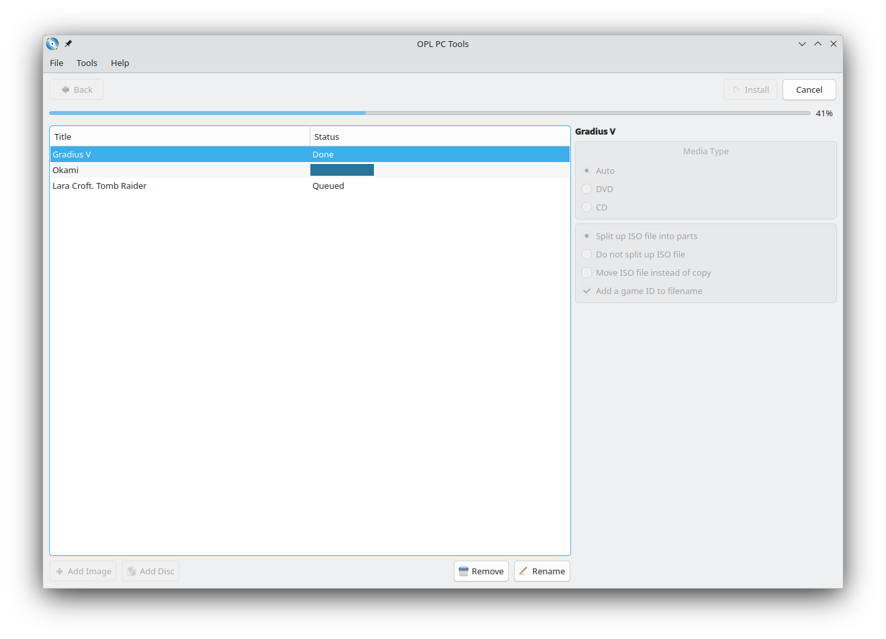

# OPL PC Tools
Tools to manage PS2 disk images used in [Open PlayStation 2 Loader](https://github.com/ifcaro/Open-PS2-Loader).

Written in Qt and running under Linux and MS Window. It is possible to build the application under MacOS X and FreeBSD,
but the CD/DVD sources will not work. It is a known issue and I am planning to fix it. Someday.

It is the absolutely open project and everyone are welcome to contribute to. But please, remember about the code-style!

## Abilitiies

#### Assigning covers and icons to games

#### Iinstalling multiple games from the different sources (CD/DVD or the *.iso files) in the automatic sequential mode

#### Recovering an *.iso file from an installed game

